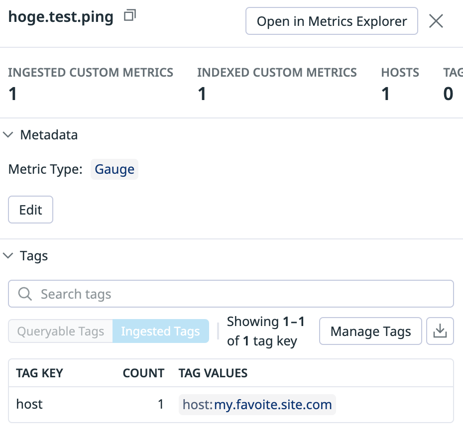
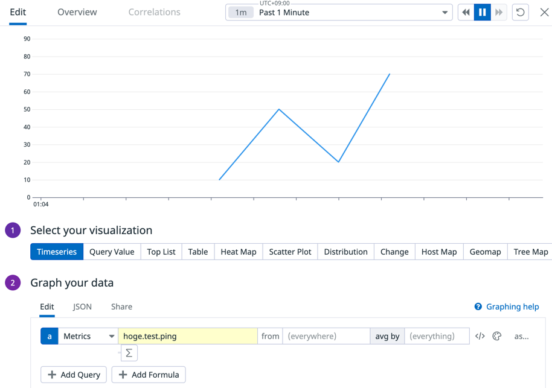
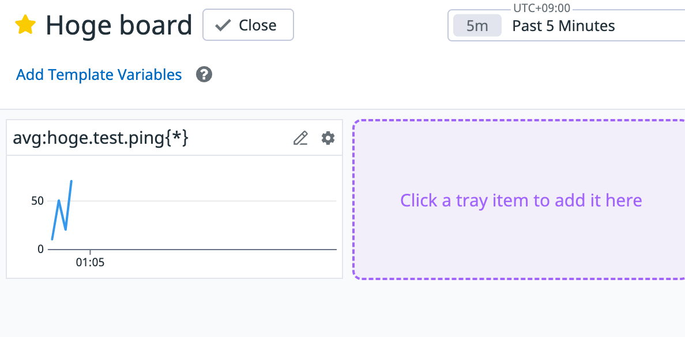
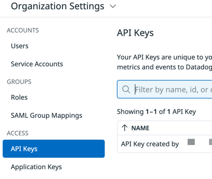

# DdPostGauge

CLI for posting [gauge](https://docs.datadoghq.com/ja/metrics/types/?tab=gauge) of custom [metrics](https://docs.datadoghq.com/ja/metrics/)  by using [DataDog/datadog-api-client-ruby](https://github.com/DataDog/datadog-api-client-ruby) for [Datadog](https://www.datadoghq.com/ja/).

## Example
Install this Gem. See [Installation](#installation).

Get Datadog API key from `Organaization Settings > API Keys`. See [api key and datadog site](#api-key-and-datadog-site).

Confirm Datadog site. See [api key and datadog site](#api-key-and-datadog-site).

Prepare `./.env` and replace dummy data.

```shell
$ cp .env.sample .env
```

`.env` file

```.env
DATADOG_API_KEY=XXXXXXXX
DATADOG_SITE=us5.datadoghq.com
```

Post 4 points of the gauge to Datadog. 

```
Metrics namae -> hoge.test.ping
Metrics value -> 10, 50, 20, 70 (4 points)
Tag -> host 
Tag value -> my.favoite.site.com
```

```shell
$ dd_post_gauge -m hoge.test.ping -v 10 -t host -r my.favoite.site.com       
$ dd_post_gauge -m hoge.test.ping -v 50 -t host -r my.favoite.site.com
$ dd_post_gauge -m hoge.test.ping -v 20 -t host -r my.favoite.site.com
$ dd_post_gauge -m hoge.test.ping -v 70 -t host -r my.favoite.site.com
```

Confirming the posted result in Datadog.

* Metrics > Summary
  

You can use posted your metrics in the dashboard like other metrics.

* `Dashboards > YOUR DASHBOARD` and `Add Widgets > Timeseries`
  
  

## Installation

Install the gem and add to the application's Gemfile by executing:

```shell
$ bundle add dd_post_gauge
```

If bundler is not being used to manage dependencies, install the gem by executing:

```shell
$ gem install dd_post_gauge
```

## Usage

```shell
$ dd_post_gauge -m <metric_name> -v <metric_value> -r <metric_resource_name>  -t <metric_resource_type> -k <api_key> -s <datadog site> 
```

`metric_name` and `metric_value` are required.

`metric_resource_name` and `metric_resource_type` are optional.

if you have `.env` in the directory and set following variables, you can omit the `api_key` and `datadog site` options.

```.env
DATADOG_API_KEY=XXXXXXXXXXXXXXXXXXXX
DATADOG_SITE=datadoghq.com
```

See `.sample.env`.

### api key and datadog site
* API key is referred from following page.
  
  * https://docs.datadoghq.com/ja/account_management/api-app-keys/
* Datadog site is referred from following page.
  * https://docs.datadoghq.com/ja/getting_started/site/

## Development

After checking out the repo, run `bin/setup` to install dependencies. Then, run `rake spec` to run the tests. You can also run `bin/console` for an interactive prompt that will allow you to experiment.

To install this gem onto your local machine, run `bundle exec rake install`. To release a new version, update the version number in `version.rb`, and then run `bundle exec rake release`, which will create a git tag for the version, push git commits and the created tag, and push the `.gem` file to [rubygems.org](https://rubygems.org).

## Contributing

Bug reports and pull requests are welcome on GitHub at https://github.com/junara/dd_post_gauge. This project is intended to be a safe, welcoming space for collaboration, and contributors are expected to adhere to the [code of conduct](https://github.com/[USERNAME]/dd_post_gauge/blob/main/CODE_OF_CONDUCT.md).

## License

The gem is available as open source under the terms of the [MIT License](https://opensource.org/licenses/MIT).

## Code of Conduct

Everyone interacting in the DdPostGauge project's codebases, issue trackers, chat rooms and mailing lists is expected to follow the [code of conduct](https://github.com/[USERNAME]/dd_post_gauge/blob/main/CODE_OF_CONDUCT.md).
